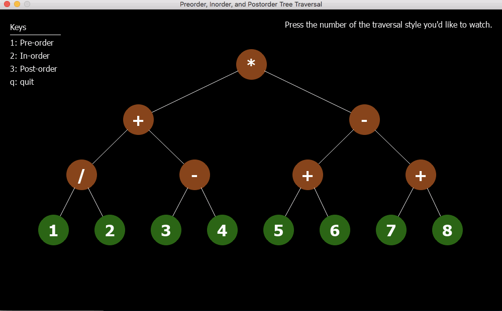

Tree Traversal Visualizer
=========================

> Good lord, the internet is horrible at explaining things! I legit might make a post about prefix vs infix vs postfix tree traversal, just because of how bad all these images are -.- [link](https://www.google.com/search?safe=off&biw=1440&bih=816&tbm=isch&sa=1&ei=iIVmW5jTAsjV5gKMkJPYBQ&q=preorder+traversal+tree&oq=preorder+traversal+tree&gs_l=img.3..0i8i30l5j0i24.3013.4124..4320...0.0...81.487.8......1....1..gws-wiz-img.......0i8i7i30.XRchNSkZJs4)
>
> -- [https://twitter.com/josh_cheek/status/1025973617979473920](https://twitter.com/josh_cheek/status/1025973617979473920)

Done.

Preorder
--------

Inorder
-------

Postorder
---------

To run the code
---------------

You'll need [Ryan Davis](https://twitter.com/the_zenspider)'s
[Graphics](https://github.com/zenspider/graphics) library.

[Here](http://rayhightower.com/blog/2017/02/15/animated-graphics-in-ruby/)
are some nice installation instructions by
[Ray Hightower](https://twitter.com/RayHightower).

License
-------

Just do what the fuck you want to.
